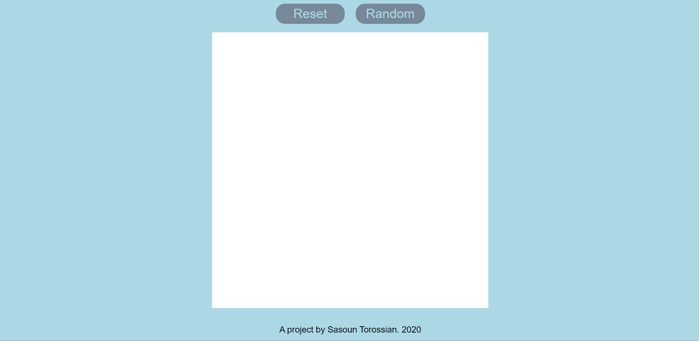

# Etch-a-sketch
Small project which adds a twist to the classic children's etch-a-sketch toy, based off the Odin Project curriculum. Allows user to colour blocks when depressing the mouse button, and generate a random pallet. Live demo can be found on github.io [here](https://sasountorossian.github.io/Etch-a-Sketch/)

Project was initially created with random geenrator to test block creation, eventually kept in as a side-feature. When starting, block lit up on mouseover, but later modified to only change colour on mousedown + mouseover. Shading over already coloured blocks added later on.

Design was simple and playful, at this stage I did not know enough css to experiment too much.

Project was fun and easy, though some consideration was needed to deal with click and unclick events while mouse was hovered outside of canvas. Canvas also needs to re-align itself in its parents container depending on canvas size, as even canvas sizes settle nicely, yet odd canvas sizes become shifted slightly.
